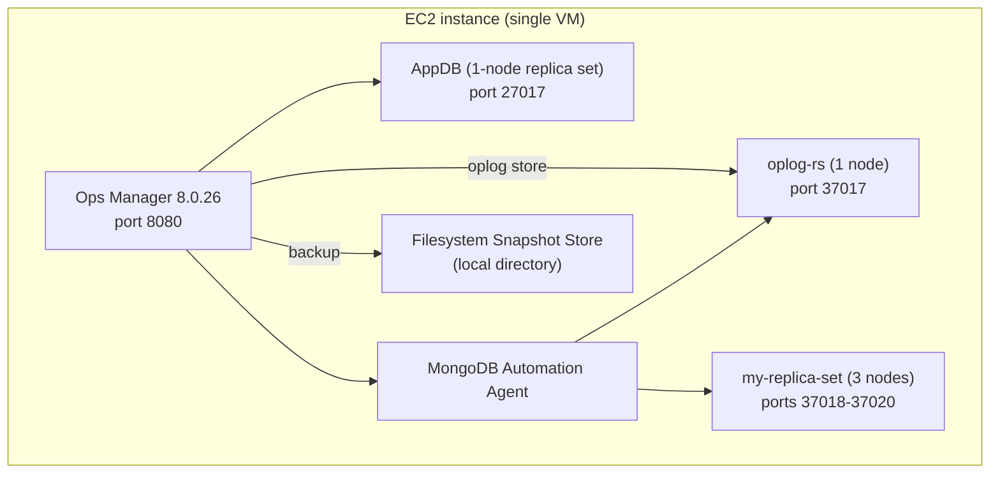

# Native Ops Manager Lab (no Kubernetes, no operator)

A single-EC2-instance lab that installs **Ops Manager directly on the host**
via the traditional rpm install - no K3s, no kind, no MongoDB Kubernetes
Operator. Everything is colocated on one VM:

- A single-node MongoDB replica set as the Ops Manager **Application Database (AppDB)**
- **Ops Manager 8.0.26** itself
- The **MongoDB Automation Agent**, deploying on the same host:
  - `oplog-rs` - a 1-node replica set used as the Backup **Oplog Store**
  - `my-replica-set` - the 3-node workload replica set
- Backup uses a **Filesystem Snapshot Store** (a local directory), not a
  Blockstore replica set



## Prerequisites

- One EC2 instance, **Amazon Linux 2023**, `x86_64`.
  - Recommended: `m5.xlarge` (4 vCPU / 16 GiB) or larger, 50+ GiB gp3 root
    volume. AppDB + Ops Manager + a 1-node oplog store + a 3-node replica set
    on one host adds up.
  - Security group inbound: 22 (SSH), 8080 (Ops Manager UI - or tunnel it over
    SSH instead of opening it to the world).
- Outbound internet access (downloads the Ops Manager rpm, MongoDB packages,
  and the Automation Agent installs MongoDB binaries for the managed replica sets).

## Download the Ops Manager RPM first

The raw RPM URL can return HTTP 403. Download the package through MongoDB's
official [Ops Manager download center](https://www.mongodb.com/try/download/ops-manager)
instead. Select **8.0.26**, **Amazon Linux 2023**, and **RPM**. The downloaded
file must be named `mongodb-mms-8.0.26.x86_64.rpm`.

Copy it to the EC2 instance, for example:

```bash
scp -i <ec2-key.pem> mongodb-mms-8.0.26.x86_64.rpm \
  ec2-user@<ec2-public-ip>:/tmp/
```

The script verifies the RPM's MongoDB signature before installing it. If the
file is elsewhere, provide its path with `OM_RPM_PATH` in the run command below.

## Run it (one command, as root)

```bash
git clone https://github.com/vijaygh-repo/native-ops-manager-lab.git
cd native-ops-manager-lab
chmod +x native-ops-manager-lab.sh

sudo env OM_RPM_PATH=/tmp/mongodb-mms-8.0.26.x86_64.rpm \
  ./native-ops-manager-lab.sh
```

The script installs MongoDB Enterprise 7.0 for the AppDB. If an earlier run
installed Community packages, it stops `mongod`, removes those RPM packages,
and installs Enterprise while preserving the existing `/var/lib/mongo` data.
It checks for the Ops Manager RPM before changing the AppDB packages.

After the RPM is downloaded and copied to EC2, the script handles the install
and bootstrap. One UI step remains: enabling the Backup Daemon and Filesystem
Snapshot Store for the first time is a short Ops Manager Admin wizard. The
script prints exactly what to click once it finishes - see "Enabling backup"
below.

Total time: 10-20 minutes, mostly package downloads and Ops Manager's first boot.

## How to log into the Ops Manager UI afterwards

This is the part that's easy to lose track of, so to be explicit:

1. The script **creates the login for you** - there is no signup step to do
   yourself. It generates a random password and creates the first Ops Manager
   user (with the Global Owner role) entirely through the API before you ever
   open a browser.
2. At the very end of the run, the script prints a block like this - **copy
   it somewhere safe, it is only shown once**:
   ```
   Ops Manager UI:  http://<ec2-ip>:8080
   Username:        admin@example.com
   Password:        <randomly generated>
   ```
3. Open that URL:
   - From the EC2 host itself: `http://localhost:8080`
   - From your laptop/browser: either open the security group's port 8080 to
     your IP only, or (safer) tunnel it: `ssh -L 8080:localhost:8080 <user>@<ec2-public-ip>`
     then browse to `http://localhost:8080` on your own machine.
4. Log in with the username/password from step 2.

If you lose the password before rotating it, it's also saved on the EC2 host at
`/root/ops-manager-credentials.txt` (root-readable only, written once at the
end of the script run) - `sudo cat /root/ops-manager-credentials.txt`.

## Enabling backup (the one manual step)

Once logged in:

1. Click **Admin** (top right) -> **Backup** tab.
2. Configure the **Backup Daemon**: set the head directory to `/data/backup_head`
   (already created and chowned to `mongodb-mms` by the script).
3. **Add Snapshot Storage** -> choose **File System Store**, point it at a
   local directory, e.g.:
   ```bash
   sudo mkdir -p /data/snapshots && sudo chown mongodb-mms /data/snapshots
   ```
4. Assign `oplog-rs` as the **Oplog Store Database** for this project.
5. Go to **Deployment -> my-replica-set -> Backup** tab -> **Start/Enable Backup**.

## Verifying it worked

```bash
systemctl status mongod mongodb-mms mongodb-mms-automation-agent
curl -s -o /dev/null -w '%{http_code}\n' http://localhost:8080/user/login   # expect 200
```

In the UI: **Deployment** should show `oplog-rs` (1 member) and
`my-replica-set` (3 members) both green/healthy. After completing "Enabling
backup" above, the `my-replica-set` Backup tab should show a completed
snapshot after the first backup cycle.

## Cleanup

This script only ever installs things on the one EC2 instance it's run on -
terminate the instance to tear the whole lab down. There's no separate
cleanup script since nothing is created outside this VM.

## Notes / limitations

- Authentication is disabled on `oplog-rs` and `my-replica-set` (test lab
  only) to keep the automation config simple - do not do this outside a lab.
- Single-node AppDB and single-node oplog store are not highly available;
  this is a functional/test setup, not a production topology.
- The AppDB uses MongoDB Enterprise 7.0. The automation configuration for
  `oplog-rs` and `my-replica-set` is separate; choose Enterprise binaries in
  Ops Manager if those managed deployments also need Enterprise-only features.
