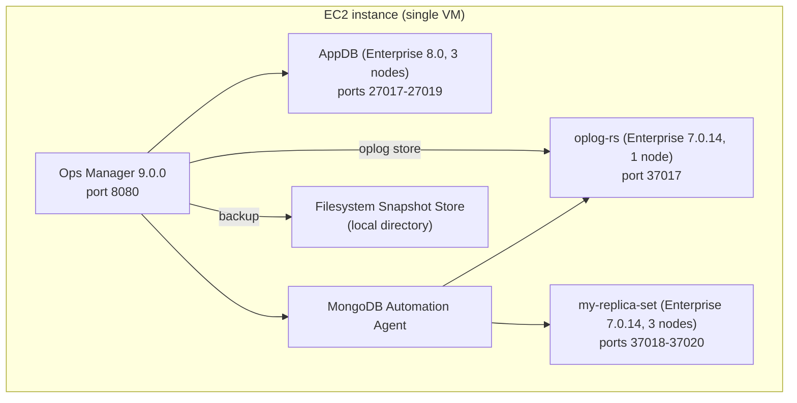

# Native Ops Manager Lab (no Kubernetes, no operator)

A single-EC2-instance lab that installs **Ops Manager directly on the host**
via the traditional rpm install - no K3s, no kind, no MongoDB Kubernetes
Operator. Everything is colocated on one VM:

- A 3-node (one host, ports 27017-27019) **MongoDB Enterprise 8.0** replica set as the Ops Manager **Application Database (AppDB)**
- **Ops Manager 9.0.0** itself
- The **MongoDB Automation Agent**, deploying on the same host:
  - `oplog-rs` - a 1-node **Enterprise** replica set used as the Backup **Oplog Store**
  - `my-replica-set` - a 3-node **Enterprise** workload replica set
- Backup uses a **Filesystem Snapshot Store** (a local directory), not a
  Blockstore replica set



## Prerequisites

- One **fresh** EC2 instance, **Amazon Linux 2023**, `x86_64`. The script stops
  if it finds Community MongoDB RPMs; it does not convert an existing install.
  - Recommended: `m5.xlarge` (4 vCPU / 16 GiB) or larger, 50+ GiB gp3 root
    volume. AppDB + Ops Manager + a 1-node oplog store + a 3-node replica set
    on one host adds up.
  - Security group inbound: 22 (SSH), 8080 (Ops Manager UI - or tunnel it over
    SSH instead of opening it to the world).
- Outbound internet access (downloads the Ops Manager rpm, MongoDB packages,
  and the Automation Agent installs MongoDB binaries for the managed replica sets).

The script downloads the versioned Ops Manager 9.0.0 RPM directly from
MongoDB's official package host and verifies its signature. No browser
download or RPM copy step is required.

## Run it (one command, as root)

```bash
git clone https://github.com/vijaygh-repo/native-ops-manager-lab.git
cd native-ops-manager-lab
chmod +x native-ops-manager-lab.sh

sudo ./native-ops-manager-lab.sh
```

The script requires a fresh VM and installs MongoDB Enterprise 8.0 for the AppDB
from the start. It aborts if Community MongoDB RPMs are detected; it does not
convert an existing Community installation. `oplog-rs` and all three
`my-replica-set` nodes are deployed using the Enterprise `7.0.14-ent` version
manifest entry. The script downloads and verifies the Ops Manager RPM before
installing MongoDB packages.

The script installs and bootstraps Ops Manager, deploys the AppDB and managed
replica sets, configures the Backup Daemon and filesystem/oplog stores through
the Ops Manager API, enables backup, sets a daily snapshot schedule, and
requests an initial on-demand snapshot. No Ops Manager UI setup steps are
required.

Total time: 10-20 minutes, mostly package downloads and Ops Manager's first boot.

To repeat a failed run on the same VM, use `sudo RESET_OM=1 ./native-ops-manager-lab.sh`.
It wipes Ops Manager state (users, projects, agent, managed deployments) but keeps the installed packages.

## How to log into the Ops Manager UI afterwards

This is the part that's easy to lose track of, so to be explicit:

1. The script **creates the login for you** - there is no signup step to do
   yourself. It generates a random password and creates the first Ops Manager
   user (with the Global Owner role) entirely through the API before you ever
   open a browser.
2. At the very end of the run, the script prints a block like this - **copy
   it somewhere safe, it is only shown once**:
   ```
   Ops Manager UI:  http://<ec2-ip>:8080
   Username:        admin@example.com
   Password:        <randomly generated>
   ```
3. Open that URL:
   - From the EC2 host itself: `http://localhost:8080`
   - From your laptop/browser: either open the security group's port 8080 to
     your IP only, or (safer) tunnel it: `ssh -L 8080:localhost:8080 <user>@<ec2-public-ip>`
     then browse to `http://localhost:8080` on your own machine.
4. Log in with the username/password from step 2.

If you lose the password before rotating it, it's also saved on the EC2 host at
`/root/ops-manager-credentials.txt` (root-readable only, written once at the
end of the script run) - `sudo cat /root/ops-manager-credentials.txt`.

## Automated backup configuration

The script configures `/data/backup_head` for the Backup Daemon, creates the
filesystem snapshot store at `/data/snapshots`, registers `oplog-rs` as the
Oplog Store, enables backup for `my-replica-set`, sets a 24-hour snapshot
schedule, and submits an initial on-demand snapshot. The final terminal output
reports the result of that snapshot request.

## Verifying it worked

```bash
systemctl status mongod mongodb-mms mongodb-mms-automation-agent
curl -s -o /dev/null -w '%{http_code}\n' http://localhost:8080/user/login   # expect 200
```

In the UI: **Deployment** should show `oplog-rs` (1 member) and
`my-replica-set` (3 members) both green/healthy. The `my-replica-set` Backup
tab should show backup as started; the initial on-demand snapshot should
complete automatically after the run finishes.

## Cleanup

This script only ever installs things on the one EC2 instance it's run on -
terminate the instance to tear the whole lab down. There's no separate
cleanup script since nothing is created outside this VM.

## Notes / limitations

- Authentication is disabled on `oplog-rs` and `my-replica-set` (test lab
  only) to keep the automation config simple - do not do this outside a lab.
- The AppDB (3 members on one host) and the single-node oplog store are not highly available;
  this is a functional/test setup, not a production topology.
- AppDB runs MongoDB Enterprise 8.0. The oplog store and workload replica set
  run MongoDB Enterprise 7.0.14.
